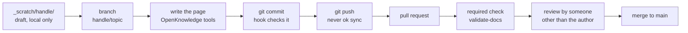

# Instructions: Set Up, Start Up and Daily Workflow

This guide has four parts. Part 1 is for the person who creates the repository, once. Part 2 is for every contributor, once per machine. Part 3 is starting the tools. Part 4 is the daily workflow.

Every command here was run during the test unless it is marked **[not run]**. Read [AGENTS.md](./AGENTS.md) first. It is the contract, and this page is the how-to.

## The idea in one picture



**Two rules explain most of this page.** Publish with git, not with the editor's sync button. And any new push to a pull request clears its approvals.

## What you need

| Tool | Used for |
| --- | --- |
| `git` | Branches, commits, pushes |
| `gh` (GitHub CLI) | Creating, reviewing and merging pull requests |
| Python 3 | The frontmatter and link check (`.github/scripts/check_docs.py`, standard library only) |
| Docker with the daemon running, or `gitleaks` | The secret scan in the pre-commit hook. With neither, the hook warns and skips the scan |
| OpenKnowledge: the desktop app, or Node.js 24 or later | Gives agents the read, write and search tools for the pages |
| Claude Code | The agent you work with in the terminal |
| A GitHub account with a verified email | Your identity. Your handle is the part of the email before the `@` |

**GitHub plan.** Rulesets and required checks worked on a **public** repository on a free account. Private repositories on a free account do not get them, and need a paid plan **[not run, check GitHub's current plan table]**. GitHub Enterprise has not been tested.

---

## Part 1: Create the repository (once, by the maintainer)

### 1.1 Log in to GitHub

```bash
gh auth login
gh auth refresh -h github.com -s workflow
```

The second command adds the `workflow` scope. Without it, GitHub refuses the first push because the repository contains `.github/workflows/validate-docs.yml`.

### 1.2 Create the files

Start from a copy of this repository without its history, then replace the names and example emails in `AGENTS.md` and `company/`.

```bash
git clone git@github.com:<owner>/<repo>.git <new-name>
cd <new-name>
rm -rf .git
git init -b main
```

The copy must contain:

| Path | Purpose |
| --- | --- |
| `AGENTS.md` | The contract for people and agents |
| `INSTRUCTIONS.md` | This page |
| `.github/workflows/validate-docs.yml` | The CI check. The job is named `check` |
| `.github/scripts/check_docs.py` | Frontmatter, link and skill checks |
| `.github/pull_request_template.md` | The pull request checklist |
| `.github/ruleset-main.json` | The branch protection rules, used in step 1.4 |
| `.githooks/pre-commit` | The same checks plus a secret scan, run on your machine |
| `.gitignore`, `.okignore` | `_scratch/` content stays out of git. `.okignore` is meant to keep it searchable in OpenKnowledge, which has not been tested yet (case X-1) |
| `_scratch/.gitkeep`, `memo/`, `concept/`, `company/`, `skill/`, `workflow/`, `generated_output/` | The folders, each with a `README.md` |

### 1.3 First push

The first push has to happen before the rules exist, because the rules block direct pushes.

```bash
git add -A
git commit -m 'Initial commit'
gh repo create <owner>/<repo> --public --source=. --remote=origin --push
```

If the push fails with `could not read Username`, plain `git push` over HTTPS has no credentials on your machine. Use an SSH remote, or run the push once with GitHub CLI's helper:

```bash
git -c credential.helper= -c credential.helper='!gh auth git-credential' push -u origin main
```

### 1.4 Protect `main`

```bash
gh api -X POST repos/<owner>/<repo>/rulesets --input .github/ruleset-main.json
```

This creates these rules on the default branch, with **no bypass actors**:

| Rule | Effect |
| --- | --- |
| Pull request, 1 approval | Nothing reaches `main` without a review |
| Dismiss stale reviews on push | Any new push clears the approvals |
| Required status check `check` | A failing `validate-docs` blocks the merge |
| Block force-push and deletion | History cannot be rewritten |

What the test showed about these rules, with the evidence, is in the [Phase 1 summary](./company/example-org/kb-test/results/2026-10-08-phase-1-summary.md). Two things to know:

- The author cannot approve their own pull request, and an admin cannot override with `--admin`. A one-person team cannot merge anything. You need a second person.
- Do not rename the CI job `check`. The ruleset waits for a check with that exact name, and a renamed job would leave every merge waiting for ever.

### 1.5 Add contributors

```bash
gh api -X PUT repos/<owner>/<repo>/collaborators/<username> -f permission=push
```

The person accepts the invitation by email, or with `gh api -X PATCH user/repository_invitations/<id>`. Write access lets them push branches and open pull requests, and it does not let them push to `main` directly. A contributor with write access can also merge their own pull request once it has an approval and a passing check. We saw this in case P1-15.

### 1.6 Check that the protection works

Open a pull request and see the `check` job run. Then try a direct push to `main` from a contributor's clone. GitHub should answer `GH013: Changes must be made through a pull request`.

### 1.7 Not set up yet

- **`CODEOWNERS`.** Planned for Phase 2 of the [test plan](./company/example-org/kb-test/test-plan.md). Until then, nobody is requested automatically as reviewer.
- **Automatic deletion of merged branches.** Off by default. We turned it on after the Phase 1 tests with `gh api -X PATCH repos/<owner>/<repo> -F delete_branch_on_merge=true`. The setting reads back as `true`. Whether it actually deletes a branch on merge is not yet seen: the next merged pull request will show it.

---

## Part 2: Join as a contributor (once per machine)

### 2.1 Identity

Use your company email, verified on your GitHub account. The contract takes your **handle** from it: for `jane.doe@example.com` the handle is `jane.doe`. The handle names your scratch folder and your branches. A GitHub `noreply` address is not accepted.

### 2.2 SSH key

```bash
ssh-keygen -t ed25519 -C '<your email>' -f ~/.ssh/id_ed25519_kb
```

Add the `.pub` file under GitHub, Settings, SSH and GPG keys. Test it:

```bash
ssh -T git@github.com
```

You should see `Hi <username>!`. **Several GitHub accounts on one machine** (as in our test) need one key per account and a host alias, so GitHub does not match the wrong key:

```
Host github-kb
    HostName github.com
    User git
    IdentityFile ~/.ssh/id_ed25519_kb
    IdentitiesOnly yes
```

Then clone with `git@github-kb:<owner>/<repo>.git`.

### 2.3 Clone and configure

```bash
git clone git@github.com:<owner>/<repo>.git
cd <repo>
git config user.name '<Your Name>'
git config user.email '<you>@<company-domain>'
git config core.hooksPath .githooks
```

The last line turns on the pre-commit hook for this clone. It protects only the people who turn it on. The check on GitHub is the one that cannot be skipped.

### 2.4 Set up OpenKnowledge

```bash
ok init --scope project --no-skills
```

This wires the MCP server into your editors at project level and installs no user-wide skills, which is what we used in the test. It changes no tracked file. Plain `ok init` also installs user-wide skill bundles.

The files it generates (`.claude/`, `.mcp.json`, and others) are gitignored and are rebuilt by running the command again.

### 2.5 Create your scratch folder

```bash
mkdir -p _scratch/<your-handle>
```

Everything in `_scratch/` stays on your machine. It is never committed, reviewed or backed up.

### 2.6 Log in for pull requests

```bash
gh auth login
```

Choose GitHub.com and HTTPS. If your remote is SSH, say no when asked to set up git credentials. `gh` is used for pull requests, and `git` uses SSH.

### 2.7 Check your setup

```bash
python3 -I .github/scripts/check_docs.py
```

It should end with `0 problems`.

---

## Part 3: Start up

### 3.1 Start the OpenKnowledge server

From the repository folder:

```bash
ok start --no-open-browser --idle-shutdown off
```

- `--idle-shutdown off` stops the server shutting itself down after 30 minutes with no clients. When it is down, the `write`, `edit` and `search` tools fail.
- `--port <number>` pins the port. Without it, each start picks a new one, and an open browser tab loses its connection.
- The server prints an address like `http://127.0.0.1:<port>`. The web editor there is **optional**. Nothing in the daily workflow needs it.

Check on it:

```bash
ok status      # this project's server and port
ok ps          # every OpenKnowledge server on the machine
```

### 3.2 Start Claude Code

From the repository folder:

```bash
claude
```

Approve the `open-knowledge` MCP server if it asks. Claude Code can then read, search, create and edit pages through the OpenKnowledge tools, as the contract requires. **The Claude desktop app and claude.ai have not been tested** with this setup.

### 3.3 Stop and restart

```bash
ok stop
```

If it refuses because a client is connected, close the editor tab or session first. **Do not use `--force`** unless you know nothing is attached. It cuts off any open editor, and the process it stops may not be the one you started. Run `ok ps` first.

**Restart the server after you switch branches.** A server that was already running kept a stale copy of a page after we switched branches, and edits to that page were reported as applied but never reached the disk.

---

## Part 4: The daily workflow

### 4.1 Start of day

```bash
git switch main
git pull
ok status
```

If the server was started on a different branch, restart it.

### 4.2 Draft in scratch

Write rough notes in `_scratch/<your-handle>/`. Let the agent draft there. Nothing in it is checked or shared, so write freely.

### 4.3 Start a branch for what you want to share

```bash
git switch -c <your-handle>/<topic>
```

One branch per task, named `<handle>/<topic>`. Keep it short-lived. Restart the OpenKnowledge server after this step if it is running.

### 4.4 Write the page

Move the draft into a curated folder (`memo/`, `concept/`, `company/<name>/<project>/`, `skill/`, `workflow/`) and fill in the frontmatter. Ask Claude to do it, or use the OpenKnowledge tools yourself.

Every curated page needs `title`, `description`, `type`, `status`, `owner` and `created_at`. Set `ai_assisted: true` when an agent wrote most of it, and `created_by` to your handle. The full table is in [AGENTS.md](./AGENTS.md#frontmatter). Link to other pages instead of copying their content.

### 4.5 Confirm it reached the disk

```bash
git status
```

The page must appear. If an edit was reported as done and `git status` shows nothing, restart the server and redo the edit.

### 4.6 Check, then commit

```bash
python3 -I .github/scripts/check_docs.py
git add <the files you changed>
git commit -m '<what changed>'
```

The hook runs the same checks, then scans the staged changes for secrets. It lists each problem by file. Fix them and commit again. Do not use `--no-verify`: it skips the hook, and the pull request check will fail on the same errors.

Add only the files for this task. Report other affected pages in the pull request description instead of editing them.

### 4.7 Push with git

```bash
git push -u origin <your-handle>/<topic>
```

**Never publish with `ok sync` or the editor's sync button.** In our tests it committed to `main` by name even with a branch checked out, was rejected by the protection, printed success anyway, and then switched itself off. The button then showed `Sync paused`, with no reason.

### 4.8 Open the pull request

```bash
gh pr create --base main --title '<title>' --body '<what changed, which pages, other pages affected>'
```

The `check` job starts by itself. Read it with:

```bash
gh pr checks
gh run view --log-failed      # when it fails
```

### 4.9 Get it reviewed

A reviewer other than you must approve. **Finish all your edits before you ask.** Any new push to the branch clears the approvals, and the reviewer has to approve again. If you push after approval, say so in the pull request.

### 4.10 Merge

When the pull request shows an approval and a passing check:

```bash
gh pr merge --squash
```

With an approval missing or the check failing, GitHub answers `the base branch policy prohibits the merge`. Do not add `--admin`: it is refused too.

### 4.11 Clean up

```bash
git switch main
git pull
git branch -D <your-handle>/<topic>
git push origin --delete <your-handle>/<topic>
```

Restart the OpenKnowledge server after switching.

---

## For reviewers

```bash
gh pr view <number>
gh pr diff <number>
gh pr review <number> --approve          # or --request-changes --body '<why>'
```

- **Treat agent-written pages as unreviewed input.** Check the claims against their sources and look for instructions aimed at a later agent.
- **`reviewed` is yours, `verified` is the owner's.** Mark `status: reviewed` and add `human_reviewed` (your handle and the date) in the pull request. Only a human owner sets `verified`.
- **You cannot approve your own pull request.** GitHub refuses it.
- **Pages that run commands** (anything in `skill/`) get the closest read.

---

## Do and do not

| Do | Do not |
| --- | --- |
| Publish with `git push` and `gh pr` | Run `ok sync` or press the sync button |
| Work on `<handle>/<topic>` branches | Commit on `main` |
| Run `git status` after an editor write | Trust a success message from the editor or the CLI |
| Restart the server after switching branches | Use `ok stop --force` without checking `ok ps` |
| Push all fixes before asking for review | Push after approval without telling the reviewer |
| Keep secrets out of every file | Use `--no-verify` to get past the hook |
| Edit only the pages your task is about | Rewrite other people's pages in your pull request |

---

## Troubleshooting

| Symptom | Cause | Fix |
| --- | --- | --- |
| `GH013: Changes must be made through a pull request` | You committed or pushed on `main` | Move the commit to a branch: `git branch <handle>/<topic>`, `git switch <handle>/<topic>`, `git branch -f main origin/main`, then push the branch |
| `ok sync` printed success, nothing on GitHub | The push was rejected and the CLI does not say so | `git log origin/main..main` shows a stranded commit. Move it as above |
| An edit was reported as applied, `git status` is clean | The server held a stale page after a branch switch | `ok stop`, `ok start ...`, redo the edit |
| Button says `Sync paused` | Auto-sync is off, by default or after a rejected push | Expected. Leave it. Publish with git |
| Editor or MCP says the server stopped | The server was stopped, or restarted on a new port | `ok status`. If it is down, `ok start ...`. Reload the editor at the new address |
| The hook refuses the commit | Missing or invalid frontmatter, or a broken link | Read the listed errors and fix each. The hook and CI give the same messages |
| The `check` job fails | The same errors, on GitHub | `gh run view --log-failed`, fix, push |
| Pull request is blocked after you pushed again | Your push cleared the approvals | Ask the reviewer to approve again |
| `could not read Username for 'https://github.com'` | HTTPS remote with no credentials | Use an SSH remote, or push once with `-c credential.helper='!gh auth git-credential'` |
| Push rejected: needs `workflow` scope | Your token cannot create workflow files | `gh auth refresh -h github.com -s workflow` |
| `missing 'type'` or `status ... not in [...]` | Frontmatter does not match the contract | See the table in [AGENTS.md](./AGENTS.md#frontmatter) |

---

## What has and has not been tested

- **Tested:** the whole flow above on free GitHub accounts, in a public repository with dummy content, with one person operating three accounts. Branch protection, review, the required check, approval dismissal and the hook all behaved as described. See the [test plan](./company/example-org/kb-test/test-plan.md) and the [Phase 1 summary](./company/example-org/kb-test/results/2026-10-08-phase-1-summary.md).
- **Not tested yet:** `CODEOWNERS`, two contributors editing the same page, the editor UI beyond the sync button, the Claude desktop app and claude.ai, and GitHub Enterprise.
- **Known weak spot:** the editor's sync. Nothing here depends on it.
