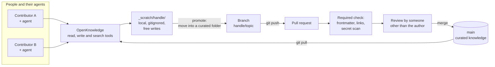
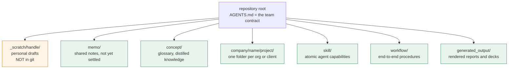
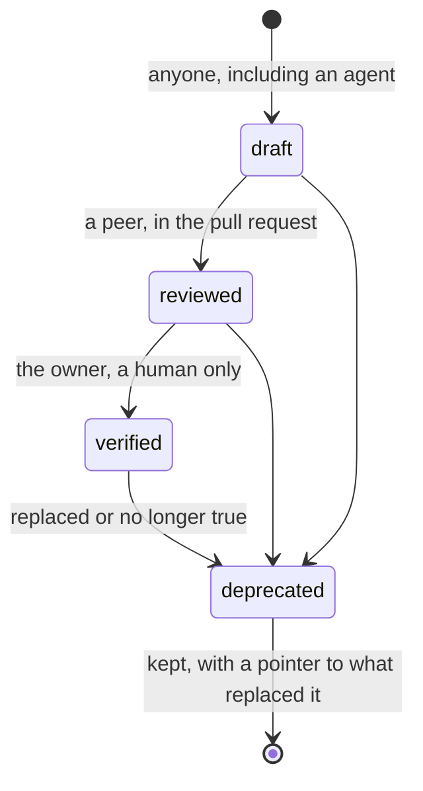
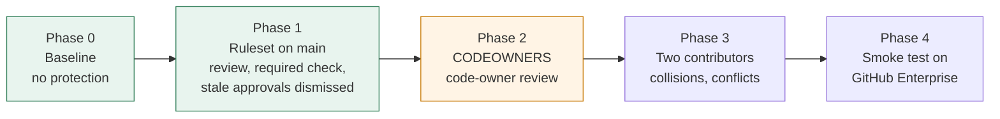
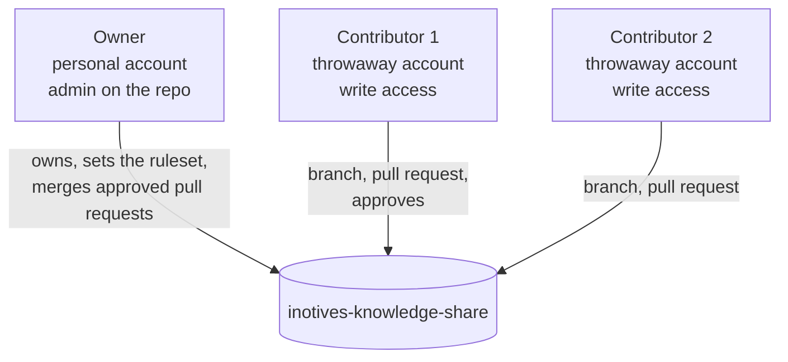

# inotives-knowledge-share

A **public test bed** for a team knowledge base where people and their AI agents write together. The stack is deliberately small:

- **[OpenKnowledge](https://github.com/inkeep/open-knowledge)** gives agents read, write and search tools over the markdown (MCP), plus an optional web editor. In our tests we publish with git, not with its sync button.
- **GitHub** is the only host. Review, history and access control all come from it.

> **Dummy content only.** Nothing in this repository is real company or client material. It exists so the workflow can be tested in the open on free GitHub accounts, before the real knowledge base is set up on GitHub Enterprise.

## Start here

| Read | For |
| --- | --- |
| [INSTRUCTIONS.md](./INSTRUCTIONS.md) | Set up from scratch, start the tools, and the daily workflow |
| [AGENTS.md](./AGENTS.md) | The contract for people and agents |
| [Test plan](./company/example-org/kb-test/test-plan.md) | Every test case, with steps, expected result and status |
| [Phase 1 summary](./company/example-org/kb-test/results/2026-10-08-phase-1-summary.md) | What Phase 1 showed, the decisions it led to, and what is still open |

## What we want to achieve

A team knowledge base is only useful if people trust it. That needs three things at once: anyone can capture knowledge quickly, shared pages are reviewed before they count, and agents can read and write without silently corrupting the record.

This repository tests whether the rules in [AGENTS.md](./AGENTS.md) actually deliver that with GitHub features we can rely on.

## How the repository is organised

Everything outside `_scratch/` is **curated**: it changes by pull request, not by direct push.

| Folder | Status | Purpose |
| --- | --- | --- |
| `_scratch/<handle>/` | Gitignored, local only | Personal notes and agent drafts. No review, no backup |
| `memo/` | Curated | Shared notes that are not yet settled |
| `concept/` | Curated | Glossary and distilled reference |
| `company/<name>/<project>/` | Curated | Content per organisation and project |
| `skill/` | Curated | Skills. Closest review, because skills execute |
| `workflow/` | Curated | Orchestrated procedures that use skills |
| `generated_output/` | Curated | Shareable renderings. Never the place a fact is edited |

## How a page matures

A page carries a `status` in its frontmatter. Agents may write drafts, but **only a human sets `verified`**.

## What we are testing

The contract makes promises that depend on how GitHub and OpenKnowledge behave. Each question links to its cases in the [test plan](./company/example-org/kb-test/test-plan.md). Answers are from one run on free accounts with one person operating all three, so none is **Confirmed** yet.

| # | Question | Status |
| --- | --- | --- |
| 1 | Does OpenKnowledge's sync bypass or break a protected `main`? | **Answered.** Timed sync was off by default. A manual `ok sync` pushed straight to an unprotected `main`, was rejected under the ruleset, and printed success anyway. We publish with git instead |
| 2 | Can an approver's own pull request be merged (bypass or second approver)? | **Answered.** Authors cannot approve their own pull request and admins cannot override with `--admin`. A second person must approve, and a write-access author can then merge |
| 3 | Do code owners resolve, by work email and by `@username`? | Pending (Phase 2) |
| 4 | Is `_scratch/` indexed by OpenKnowledge, and can agents write to it, while Git ignores it? | Pending (case X-1) |
| 5 | Do the CI checks and the pre-commit hook catch bad frontmatter, broken links and a planted fake secret? | **Partly answered.** The required check blocks a failing pull request, and the hook refused invalid frontmatter. Broken links and a planted secret are not tested |
| 6 | What happens when two contributors edit the same page? | Pending (Phase 3) |
| 7 | Does it still work on GitHub Enterprise, where org rulesets and SSO apply? | Pending (Phase 4). Free accounts cannot show this |

## Test phases

Each phase adds one control, so any change in behaviour can be traced to it. Results are written up as pages in this repository.

Phases 0 and 1 are done (green). **Phase 2 is next** (amber). `main` is protected by a ruleset: pull request and 1 approval, a required `validate-docs` check, approvals dismissed on every new push, no bypass actors. The ruleset is in [.github/ruleset-main.json](./.github/ruleset-main.json). There is no `CODEOWNERS` file yet.

## Accounts used in the test

Each account has its own SSH key and its own clone, so every action is attributable to one identity. One person operates all three, so approvals prove how the rules work, not that independent review happens.

## Status

- **Done:** Phase 0 and Phase 1. Every Phase 1 case is observed. See the [Phase 1 summary](./company/example-org/kb-test/results/2026-10-08-phase-1-summary.md) for the evidence and the open items.
- **Main finding:** GitHub's controls held, including for the admin. OpenKnowledge's sync did not fit the contract, so pages are written with its tools and published with git.
- **Next:** Phase 2, code owners.
- Findings are added here only when they are observed, not before.

## Using this repository

The full steps are in [INSTRUCTIONS.md](./INSTRUCTIONS.md). In short:

1. Read [AGENTS.md](./AGENTS.md). It is the contract for people and agents.
2. `git config user.email '<verified address>'` and `git config user.name '<name>'`.
3. `git config core.hooksPath .githooks` to enable the local pre-commit check.
4. `ok init` to set up OpenKnowledge and the agent tool config. Generated files are gitignored.
5. Work in `_scratch/<handle>/`, then promote to a curated folder by pull request. Publish with `git push` and `gh pr create`, never with the editor's sync.

Do not store passwords, tokens, keys or any real company or personal data here. This repository is public.

<!-- P2-7 probe -->
