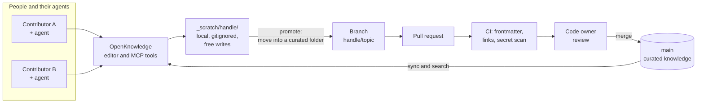
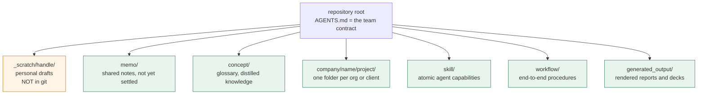
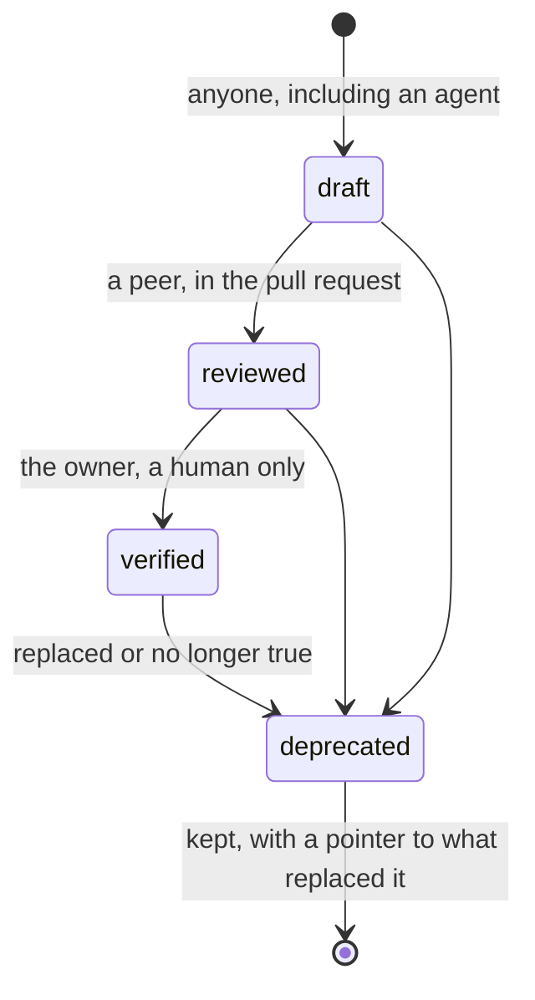
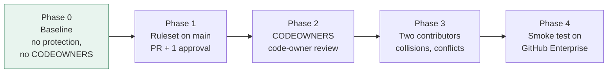
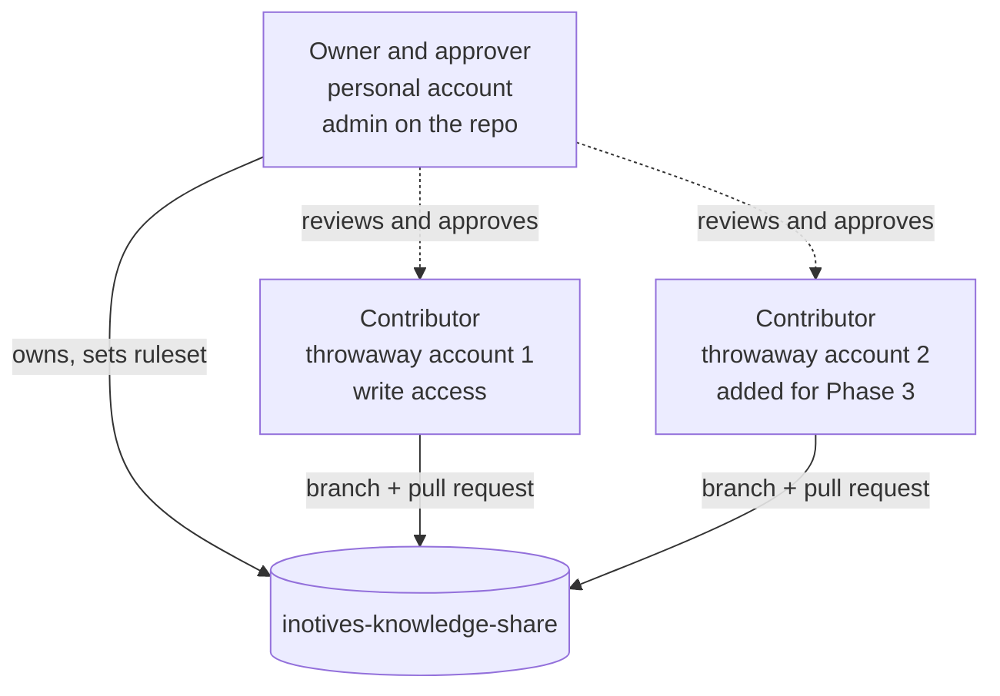

# inotives-knowledge-share

A **public test bed** for a team knowledge base where people and their AI agents write together. The stack is deliberately small:

- **[OpenKnowledge](https://github.com/inkeep/open-knowledge)** is the editor and the AI control panel (markdown files plus MCP tools for agents).
- **GitHub** is the only host. Review, history and access control all come from it.

> **Dummy content only.** Nothing in this repository is real company or client material. It exists so the workflow can be tested in the open on free GitHub accounts, before the real knowledge base is set up on GitHub Enterprise.

## What we want to achieve

A team knowledge base is only useful if people trust it. That needs three things at once: anyone can capture knowledge quickly, shared pages are reviewed before they count, and agents can read and write without silently corrupting the record.

This repository tests whether the rules in [AGENTS.md](./AGENTS.md) actually deliver that with GitHub features we can rely on.

## How the repository is organised

Everything outside `_scratch/` is **curated**: it changes by pull request, not by direct push.

| Folder | Status | Purpose |
| --- | --- | --- |
| `_scratch/<handle>/` | Gitignored, local only | Personal notes and agent drafts. No review, no backup |
| `memo/` | Curated | Shared notes that are not yet settled |
| `concept/` | Curated | Glossary and distilled reference |
| `company/<name>/<project>/` | Curated | Content per organisation and project |
| `skill/` | Curated | Skills. Closest review, because skills execute |
| `workflow/` | Curated | Orchestrated procedures that use skills |
| `generated_output/` | Curated | Shareable renderings. Never the place a fact is edited |

## How a page matures

A page carries a `status` in its frontmatter. Agents may write drafts, but **only a human sets `verified`**.

## What we are testing

The contract makes promises that depend on how GitHub and OpenKnowledge behave. The first three are the ones that could change the design.

| # | Question | Why it matters |
| --- | --- | --- |
| 1 | Does OpenKnowledge's timed sync bypass or break a protected `main`? | If the editor pushes straight to `main`, pull-request review does not hold |
| 2 | Can an approver's own pull request be merged (bypass or second approver)? | A one-approver pilot needs a workable answer |
| 3 | Do code owners resolve, by work email and by `@username`? | Required review depends on it |
| 4 | Is `_scratch/` indexed by OpenKnowledge, and can agents write to it, while Git ignores it? | Drafts must be searchable but never pushed |
| 5 | Do the CI checks and the pre-commit hook catch bad frontmatter, broken links and a planted fake secret? | The checks are the only automation |
| 6 | What happens when two contributors edit the same page? | Conflicts must be visible and never auto-resolved |
| 7 | Does it still work on GitHub Enterprise, where org rulesets and SSO apply? | Free accounts cannot show this |

## Test phases

Each phase adds one control, so any change in behaviour can be traced to it. Results are written up as pages in this repository.

**Phase 0 is the current state.** The repository has the contract, the folders and the CI checks, but no ruleset and no `CODEOWNERS`. This shows what OpenKnowledge and GitHub do by default, which is the baseline every later phase is compared with.

## Accounts used in the test

Each account has its own SSH key and its own clone, so every action is attributable to one identity.

## Status

- Phase 0 is being set up. No test has been run yet, so this repository makes no claims about how the workflow behaves.
- Findings will be added here as they are confirmed, not before.

## Using this repository

1. Read [AGENTS.md](./AGENTS.md). It is the contract for people and agents.
2. `git config user.email "<verified address>"` and `git config user.name "<name>"`.
3. `git config core.hooksPath .githooks` to enable the local pre-commit check.
4. `ok init` to set up OpenKnowledge and the agent tool config. Generated files are gitignored.
5. Work in `_scratch/<handle>/`, then promote to a curated folder by pull request.

Do not store passwords, tokens, keys or any real company or personal data here. This repository is public.
